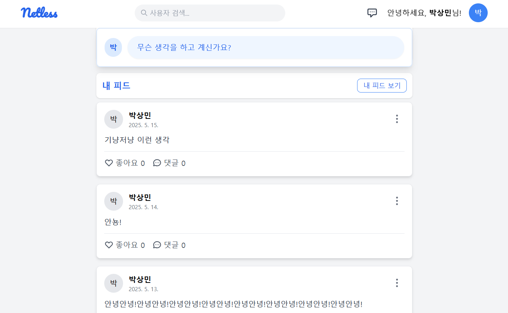
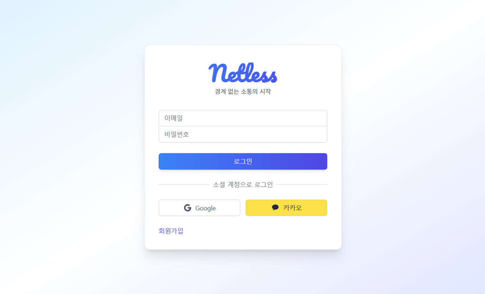

# Netless - Express & React SNS 프로젝트


## 🚀 프로젝트 개요

실시간 소셜 네트워킹 플랫폼으로, 사용자들이 게시글을 작성하고 실시간 메시징을 할 수 있는 웹 애플리케이션입니다.

## 📸 주요 화면

### 메인 피드


_사용자들의 게시글과 실시간 업데이트되는 피드 화면_

### 실시간 메시징


_Socket.io를 활용한 1:1 실시간 채팅 기능_

### 로그인 & 회원가입




_로컬 인증 및 소셜 로그인(Google, Kakao) 지원_

### 내 피드


_내가 업로드한 피드 확인 및 친구 관리_

### 프로필 관리


_프로필 이미지 업로드 및 개인정보 관리_

## 🛠 기술 스택

### Frontend (React)

- **React** 19.1.0 - UI 라이브러리
- **React Router Dom** - SPA 라우팅
- **Socket.io Client** - 실시간 통신
- **TailwindCSS** - CSS 프레임워크
- **React Toastify** - 알림 메시지

### Backend (Express)

- **Express** 5.1.0 - Node.js 웹 프레임워크
- **MongoDB & Mongoose** - NoSQL 데이터베이스
- **Passport.js** - 인증 미들웨어 (Local, Google, Kakao)
- **Socket.io** - 실시간 통신
- **Multer** - 파일 업로드
- **bcryptjs** - 비밀번호 암호화

## 🎯 주요 기능

### 1. 사용자 인증 시스템

- 로컬 회원가입/로그인
- 소셜 로그인 (Google, Kakao)
- 세션 기반 인증 관리

### 2. 게시글 시스템

- 게시글 작성/수정/삭제
- 이미지 업로드 기능
- 좋아요/댓글 기능
- 피드 타임라인

### 3. 실시간 메시징

- 1:1 채팅 기능
- Socket.io를 활용한 실시간 통신
- 메시지 알림 시스템

### 4. 친구 관리

- 친구 추가/삭제
- 친구 목록 관리

### 5. 프로필 관리

- 프로필 이미지 업로드
- 개인정보 수정

## 📁 프로젝트 구조

```
express-sns-app/
├── client/                 # React 프론트엔드
│   ├── src/
│   │   ├── components/     # 재사용 컴포넌트
│   │   ├── pages/         # 페이지 컴포넌트
│   │   ├── hooks/         # 커스텀 훅
│   │   ├── services/      # API 서비스
│   │   └── utils/         # 유틸리티 함수
│   └── public/
├── server/                # Express 백엔드
│   ├── routes/           # API 라우터
│   ├── models/           # MongoDB 스키마
│   ├── config/           # 설정 파일
│   ├── middlewares/      # 커스텀 미들웨어
│   └── public/           # 정적 파일
└── package.json          # 루트 패키지 설정
```

## 🌐 배포 환경

- **Frontend**: Vercel (https://netless.vercel.app)
- **Backend**: Render (서버 배포)
- **Database**: MongoDB Atlas

## 💡 개발 과정에서의 주요 해결 과제

### 1. 쿠키 기반 세션 인증 문제

**문제 상황**:

- 프론트엔드(Vercel)와 백엔드(Render)가 서로 다른 도메인에 배포되어 쿠키 기반 세션 인증이 작동하지 않음
- 브라우저의 Same-Origin Policy로 인해 다른 도메인 간 쿠키 공유 불가
- `credentials: true` 설정만으로는 근본적인 해결이 되지 않음

**해결 과정**:

- **도메인 구매 및 통일**: `kkary.com` 도메인을 구매하여 서브도메인 구조로 통일
  - Frontend: `https://kkary.com` 또는 `https://www.kkary.com`
  - Backend: API 서버도 같은 도메인 하위로 설정
- 쿠키의 `domain` 속성을 `.kkary.com`으로 설정하여 모든 서브도메인에서 세션 공유
- DNS 설정 및 도메인 연결 작업 수행

**깨달은 점**:

- 웹 보안의 중요성과 브라우저의 Same-Origin Policy 동작 원리 이해
- 실제 서비스에서는 도메인 설계가 인증 시스템에 미치는 영향이 크다는 것을 체감
- 개발 환경과 프로덕션 환경의 차이점과 배포 시 고려사항들을 경험
- 비용을 들여서라도 사용자 경험을 개선하는 것의 중요성 인식

### 2. 실시간 통신 구현

- Socket.io를 활용한 실시간 메시징 시스템 구축
- 연결 관리 및 메시지 전송 최적화

### 3. 인증 시스템 구축

- Passport.js를 활용한 다중 인증 전략 구현
- 세션 관리 및 보안 강화

## 🚀 로컬 실행 방법

```bash
# 전체 의존성 설치
npm run install:all

# 개발 모드 실행 (클라이언트 + 서버 동시 실행)
npm run dev

# 서버만 실행
npm run server:dev

# 클라이언트만 실행
npm run client:dev
```

## 📊 성능 최적화

- 컴포넌트 최적화 및 재사용성 향상
- API 호출 최적화
- 이미지 최적화 및 압축

---

## 수정 및 보완
1. ~~회원가입 시 비밀번호 유효성 검증~~
2. ~~회원가입 시 비밀번호 추가 검증~~ 
3. ~~회원가입 시 로그인 페이지 회원가입됐다라는 문구나 로딩~~ 
4. ~~회원가입 시 로그인 페이지 회원가입됐다라는 문구나 로딩~~ 
5. ~~알 수도 있는 사람에서 친구 추가 시 계속 친구 추가 표시나서 중복 신청이 되는 현상~~
6. ~~회원가입 시 실 이메일 인증번호 검증~~ 
7. ~~DM 온라인 표시 및 메시지 보낸 후 input 창 focus~~
8. 사용자 피드 친구 요청 시 버튼 안바뀜, 친구 목록 조회 시 사용자 목록 안나옴( 실제 친구 개수랑 친구 목록이랑 다름 => 친구 요청간 것도 카운트되는 것으로 예상) 
   
**개발 기간**: 약 1개월  
**팀 구성**: 개인 프로젝트  
**URL**: [[프로젝트 바로가기](https://netless.vercel.app/)]
